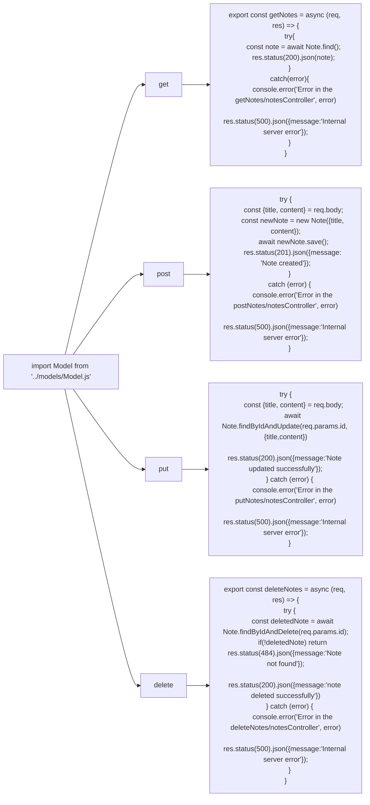

```mermaid
flowchart LR

B["import Model from '../models/Model.js'"]

B --> get --> A["export const getNotes = async (req, res) => {
    try{
        const note = await Note.find();
        res.status(200).json(note);
    }
    catch(error){
        console.error('Error in the getNotes/notesController', error)
        res.status(500).json({message:'Internal server error'});
    }
}"] 

B --> post --> C["try {
        const {title, content} = req.body;
        const newNote = new Note({title, content});
        await newNote.save();
        res.status(201).json({message: 'Note created'});
    }
    catch (error) {
        console.error('Error in the postNotes/notesController', error)
        res.status(500).json({message:'Internal server error'});
    }"]

B --> put --> D["try {
        const {title, content} = req.body;
        await Note.findByIdAndUpdate(req.params.id, {title,content})
        res.status(200).json({message:'Note updated successfully'});
    } catch (error) {
        console.error('Error in the putNotes/notesController', error)
        res.status(500).json({message:'Internal server error'});
    }"]


B --> delete --> E["export const deleteNotes = async (req, res) => {
    try {
        const deletedNote = await Note.findByIdAndDelete(req.params.id);
        if(!deletedNote) return res.status(484).json({message:'Note not found'});
        res.status(200).json({message:'note deleted successfully'})
    } catch (error) {
        console.error('Error in the deleteNotes/notesController', error)
        res.status(500).json({message:'Internal server error'});
    }
}"]
```
****

```js
const note = await Note.find();
res.status(200).json(note);
```
this is used to fetch the data and print it like json