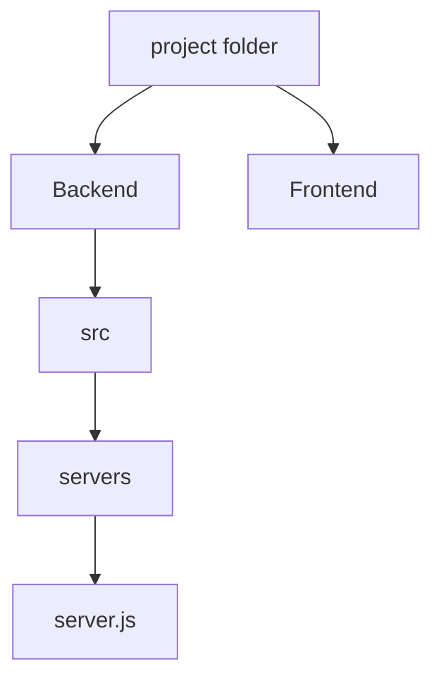

## Why we use `node` and `nodemon`?
* We use `nodemon` only while we are develpoing 
> nodemon server.js
  * **Why?**
  * because we want to develope, see the cahnges instanyly we have made.
* Once we deploy it we then dont use nodemon, then we must use `node` only.
> node server.js
  * **Why?**
  * We dont want to change the code even if small change is made while updating it, thats why we must use `node`
> **while making `npm run dev` or `nom start`** in the package.json
> remember that write
```js
 "scripts": {
    "dev": "nodemon src/server.js", 
    "start": "node src/server.js"
  },
```
why `src/server.js` because it is in src folder, if it was in servers which was in src then it would be written as `src/servers/server.js`
but no need to write src/server.js if it is in Backend, we can directly write `node server.js`


****


## `routes` folder
Make a folder `routes` for routes
keep all the get, post, put, delete functions in there and call them from server.js

****

## `controller` folder
Make a folder `controller` for function body of the get, post, put, delete functions in the routes

