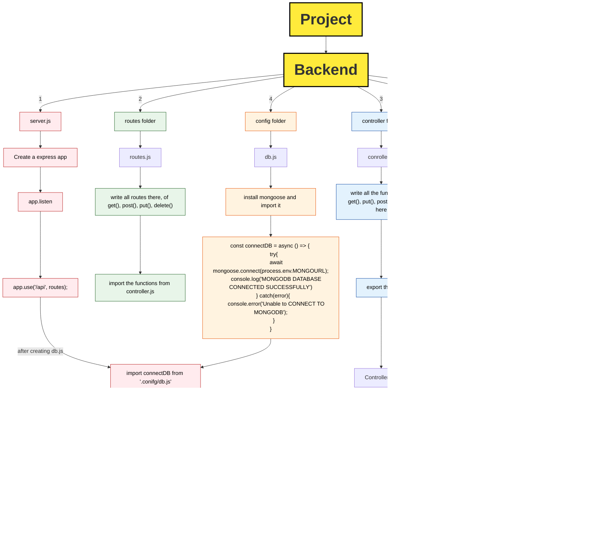

[create SCHEMA](WorkflowSCHEMA.md)  
[model based on this schema](WorkflowModel.md)

```mermaid
flowchart TD

A[Project] --> B[Backend] -- 1 --> C[server.js] --> D[Create a express app] --> E[app.listen] --> F["app.use('/api', routes);"] -- "after creating db.js" --> P[import connectDB from '.conifg/db.js'] --> Q["write connectDB() in server.js"] -- "after we have written .env and installed dotenv" --> T[import dotenv from 'dotenv'] --> U["dotenv.config();"]

B[Backend] -- 2 --> G[routes folder] --> routes.js --> H["write all routes there, of get(), post(), put(), delete()"] --> I[import the functions from controller.js]

B[Backend] -- 3 --> J[controller folder] --> conroller.js --> K["write all the functions for get(), put(), post(), delete() here"] --> L[export them] --> Controller.md

B[Backend] -- 4 --> M[config folder] --> db.js --> N[install mongoose and import it] 
N[install mongoose and import it] --> O["const connectDB = async () => { 
    try{
        await mongoose.connect(process.env.MONGOURL);
        console.log('MONGODB DATABASE CONNECTED SUCCESSFULLY')
    } catch(error){ 
        console.error('Unable to CONNECT TO MONGODB');
    }
}"] --> P

B[Backend] -- 5 --> .env --> R[put imp things in it] --> S[npm i dotenv] --> T

B[Backend] -- 6 --> V[models folder] --> Model.js --> W[import mongoose] --> X[create SCHEMA] --> Y[model based off of that schema]

%% Default: Big + Bold for everyone
classDef bigBold font-size:32px,font-weight:bold,stroke:#333,stroke-width:2px;

%% Super Big for A & B
classDef superBig font-size:44px,font-weight:bolder,stroke:#000,stroke-width:3px,fill:#ffeb3b;

%% Apply classes
class * bigBold;
class A,B superBig;

%% Section Colors (to keep contrast)
classDef server fill:#ffebee,stroke:#b71c1c,color:#000;
classDef routes fill:#e8f5e9,stroke:#1b5e20,color:#000;
classDef controller fill:#e3f2fd,stroke:#0d47a1,color:#000;
classDef config fill:#fff3e0,stroke:#e65100,color:#000;
classDef env fill:#f3e5f5,stroke:#4a148c,color:#000;
classDef models fill:#ede7f6,stroke:#311b92,color:#000;

%% Apply colors
class C,D,E,F,P,Q,T,U server;
class G,H,I routes;
class J,K,L controller;
class M,N,O config;
class R,S env;
class V,W,X,Y models;

%% Clickable links for schema + model
click X "WorkflowSCHEMA.md" "Open WorkflowSCHEMA.md"
click Y "WorkflowModel.md" "Open WorkflowModel.md"
```