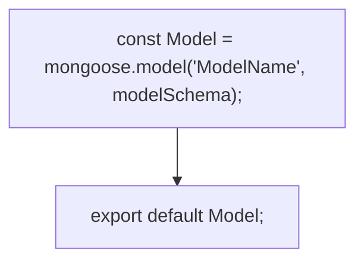

all this in Model.js

****


```mermaid
flowchart TD
A["const Model = mongoose.model('ModelName', modelSchema);"] --> B[export default Model;]
```

****

```js
const Model = mongoose.model('ModelName', modelSchema);
```
here this will able every node to have the schema