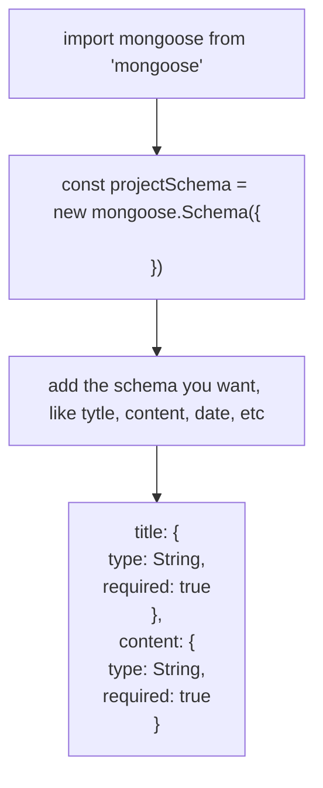

all this in Model.js

```mermaid
flowchart TD

A["import mongoose from 'mongoose'"] --> B["const projectSchema = new mongoose.Schema({

})"] --> C[add the schema you want, like tytle, content, date, etc] --> D["title: {
            type: String,
            required: true
        },
        content: {
            type: String,
            required: true
        }"]

```
